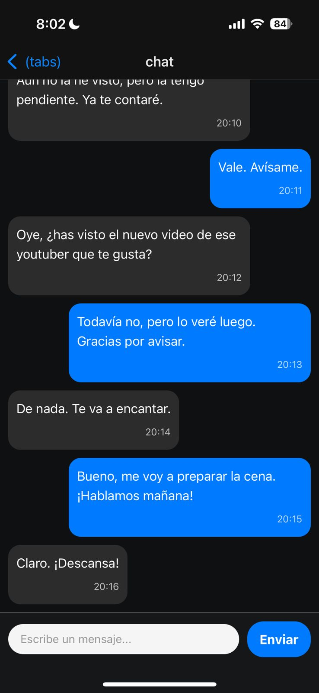

# Global Think Technology Expo App

Este repositorio contiene el código fuente para una app de mensajería estilo Whatsapp, una aplicación móvil desarrollada con React Native y [Expo](https://expo.dev). La misma se desarrollo con el objetivo de cumplir con la entrevista técnica.

## Requisitos Previos

Para ejecutar este proyecto, necesitas tener instalados en tu máquina:

-   **Node.js**: Se recomienda la versión LTS. Puedes descargarlo desde [nodejs.org](https://nodejs.org/).
-   **npm** o **yarn**: El gestor de paquetes que viene con Node.js.
-   **Expo CLI**: La herramienta de línea de comandos de Expo. Puedes instalarla globalmente ejecutando:

```bash
npm install -g expo-cli
```

## Empezar

### 1. Descargar el Repositorio

Clona este repositorio en tu máquina local usando Git:

```bash
git clone [https://github.com/tu-usuario/nombre-del-repo.git](https://github.com/tu-usuario/nombre-del-repo.git)
cd nombre-del-repo
 ```

### 2. Instalar Dependencias

Una vez que estés en la carpeta del proyecto, instala todas las dependencias necesarias:

```bash
npm install
```

### 3. Iniciar la App

Para arrancar el servidor de desarrollo de Expo, ejecuta el siguiente comando:

```bash
npx expo start
```

En la salida de la terminal, encontrarás varias opciones para ver la app:

- [Development Build](https://docs.expo.dev/develop/development-builds/introduction/): Para un entorno de desarrollo más avanzado.
- [Android Emulator](https://docs.expo.dev/workflow/android-studio-emulator/) o [iOS simulator](https://docs.expo.dev/workflow/ios-simulator/): Si tienes configurados los emuladores o simuladores de Android/iOS.
- [Expo Go](https://expo.dev/go): Un entorno de pruebas limitado para empezar rápidamente.

## Screenshots

Aquí tienes algunas capturas de pantalla de la aplicación en acción:





